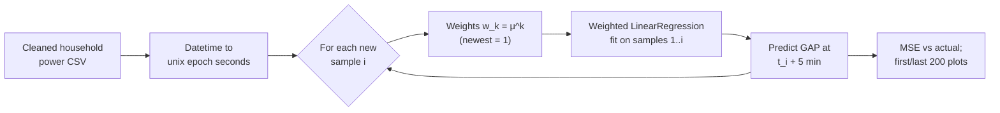

<div align="center">

# Streaming Linear Regression for IoT Power Forecasting

**Lightweight, edge-friendly forecasting of household Global Active Power 5 minutes ahead, using weighted linear regression with an exponential forgetting factor.**


</div>

## Overview

This graduate course lab was completed for **AAI-530 (IoT)** in the M.S. in Applied Artificial Intelligence program at the University of San Diego. It is the second of three labs on the same smart-meter dataset:

1. [Cleaning & EDA](https://github.com/oxayavongsa/aai-iot-cleaning-and-eda)
2. **Linear regression** (this repo)
3. [LSTM forecasting](https://github.com/oxayavongsa/aai-iot-lstm)

Linear regression is cheap enough to run on an edge device, which keeps latency low. This lab simulates a live sensor stream. At every new reading, a weighted least-squares model is refit on all history seen so far. Older points are down-weighted by a forgetting factor **μ**, and the model predicts Global Active Power (GAP) at a **5-minute predictive horizon (ph)**.

## Key results

The setup was 5,000 streamed samples, ph = 5 min, and MSE was measured against the actual GAP 5 minutes ahead. All values come from the executed notebook outputs.

| Model | Inputs | μ | MSE |
|---|---|---|---|
| Baseline | time | 0.9 | **0.5988** |
| No forgetting | time | 1.0 | 1.4433 |
| Aggressive forgetting | time | 0.01 | 7.9853 |
| Multivariate | time + voltage | 0.9 | 0.5970 |
| Smoothed target | time; 5-pt moving-average GAP | 0.9 | **0.3789** \* |

\* *The smoothed-target model is scored against the smoothed series, so its MSE is not strictly comparable to the raw-target rows.*

**Takeaways**
- **The forgetting factor is the biggest lever.** μ = 0.9 beat "remember everything" (μ = 1) by about 2.4x and "remember almost nothing" (μ = 0.01) by about 13x in MSE.
- **Adding voltage barely helped** (0.5988 to 0.5970), which matches the EDA finding that voltage carries little signal about load.
- **Smoothing the target** gives a more stable fit (MSE 0.38). The model still lags sharp spikes, which motivated the [LSTM follow-up](https://github.com/oxayavongsa/aai-iot-lstm).

## Approach



- **Online refit:** the model is refit on each prefix of the stream, starting from 2 points, with `sample_weight = μ^(age)`.
- **Experiments:** a μ sweep (0.9 / 1 / 0.01), a second regressor (voltage, held at its last known value), and an alternative target (a 5-sample rolling mean of GAP).
- **Diagnostics:** predicted vs. actual plots for the first and last 200 points of each run, plus a reusable `run_streaming_regression()` helper.

## Dataset

The data is the [UCI Individual Household Electric Power Consumption](https://archive.ics.uci.edu/ml/datasets/Individual+household+electric+power+consumption) dataset after cleaning. It is included here as [`household_power_clean.zip`](household_power_clean.zip): about 63 MB zipped and about 313 MB unzipped, with **2,049,280** one-minute rows and 15 columns, including the original measurements plus `Datetime` and monthly-average helper columns.

## Tech stack

Python 3.12 · scikit-learn (`LinearRegression`, `mean_squared_error`) · pandas · NumPy · Matplotlib · Google Colab

## Repository structure

| File | Description |
|---|---|
| [`Linear_Regression_for_IoT_Completed.ipynb`](Linear_Regression_for_IoT_Completed.ipynb) | Completed notebook with code, outputs, plots and written analysis |
| [`Linear Regression for IoT.ipynb`](Linear%20Regression%20for%20IoT.ipynb) | Original assignment template (not executed) |
| [`household_power_clean.zip`](household_power_clean.zip) | Cleaned dataset (`household_power_clean.csv`) |
| `README.md` | This file |

## How to run

```bash
git clone https://github.com/oxayavongsa/aai-iot-linear-regression.git
cd aai-iot-linear-regression
unzip household_power_clean.zip          # -> household_power_clean.csv
pip install pandas numpy scikit-learn matplotlib jupyter
jupyter notebook Linear_Regression_for_IoT_Completed.ipynb
```

The notebook was written for Google Colab. When you run it locally, skip the `drive.mount(...)` cell and change the `pd.read_csv(...)` path to `household_power_clean.csv`. Each 5,000-sample streaming run refits 4,999 models, so expect a few minutes per experiment.

## Acknowledgments

The assignment template was provided by the course instructor ([amarbut/aai-iot-linear-regression](https://github.com/amarbut/aai-iot-linear-regression)). The data comes from the UCI ML Repository.

---

<div align="center">

**Outhai (Thai) Xayavongsa** · M.S. Applied Artificial Intelligence (University of San Diego) · MBA

[GitHub](https://github.com/oxayavongsa) · [Portfolio](https://oxayavongsa.github.io/ai-automation-portfolio/)

</div>
